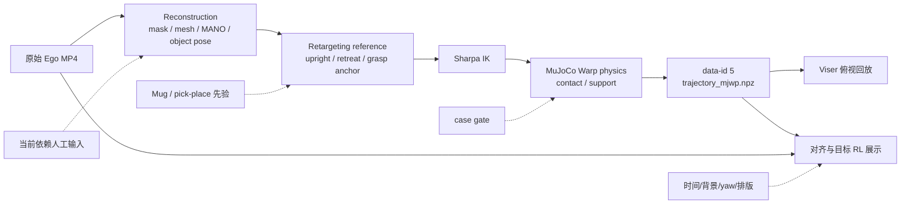

# Ego Mug Demo Walkthrough

本文回溯 `mug_pickplace_10s` 从原始 Ego MP4 到最终 `data-id 5`、俯视回放和
目标 RL 展示视频的完整过程。重点不是给出一条看似干净的命令，而是区分：

- 哪些命令确实出现在远端 shell history 中；
- 最终结果继承了哪些早期 trial；
- 哪些设置改变了 Retargeting 参考、场景或物理优化；
- 哪些只是为了让 demo 更像原视频的 presentation overfitting。

> 证据边界：标为“实际执行”的命令来自远端 history；标为“等价复现”的命令
> 由保存的 NPZ、YAML、XML 或 JSON manifest 还原，不宣称曾以这一整条形式执行。

## 1. 当前架构、目标和缺口



目标架构不是永久保留这些数值，而是把它们替换为可估计、可验证的数据：

| 当前缺口 | 本 demo 的临时做法 | 泛化目标 |
|---|---|---|
| 物体语义轴未知 | 手工指定 Mug mesh local `+Y` 为杯口轴 | 从 mesh、类别或多视角估计可放置姿态 |
| 抓取 affordance 未知 | 手工指定杯把锚点 `[0,0,-0.055] m` | 自动生成并评分 grasp/affordance candidates |
| 单目手物尺度和相对位姿漂移 | `0.015 m` in-hand gate | 联合优化尺度、手物相对位姿与接触状态 |
| 放置/撤手阶段不可靠 | 强制首尾 pedestal、末尾速度外推 | 自动分段 approach/grasp/transport/place/release |
| moving ego 相机无逐帧外参 | 稳定 top-down 相机 + 后期桌面 homography | 重建相机内参/外参并统一到世界坐标 |
| 成功只在一个 case 验证 | id 0–5 人工迭代 | 跨物体、视频、视角和 seed 的 benchmark/eval |

## 2. 机器、仓库和数据位置

| 角色 | 位置 |
|---|---|
| 本地仓库 | `/mnt/d/mengjq/research_projects/do-as-i-do` |
| 远端 SSH alias | `PhysicsAssets`（`jiaqimeng@115.190.185.113`） |
| 远端仓库 | `/home/jiaqimeng/projects/do-as-i-do` |
| 原视频/重建输出 | `/data/jiaqimeng/do-as-i-do-runs/mug_pickplace_10s` |
| 最终 Retargeting | `retargeting/outputs/sharpa/right/mug_pickplace_10s/5` |

本机负责改代码、同步和 SSH 端口转发；Reconstruction、MJWP/MPC 等 GPU 工作在
远端运行。GPU 任务应先由操作者执行 `nvidia-smi` 选择空闲卡，再显式运行命令。

## 3. 实际命令时间线

### 3.1 Reconstruction：从 MP4 生成重建数据

原始输入：

```text
/data/jiaqimeng/do-as-i-do-runs/mug_pickplace_10s/mug_pickplace_10s.mp4
```

实际执行：

```bash
cd ~/projects/do-as-i-do
source dependency_management/activate.sh
cd reconstruction

CUDA_VISIBLE_DEVICES=4 PYTHONUNBUFFERED=1 ./run_pipeline.sh \
  /data/jiaqimeng/do-as-i-do-runs/mug_pickplace_10s/mug_pickplace_10s.mp4 \
  35 \
  mug \
  right \
  "855,690;890,716;760,660;960,660" \
  "1;1;0;0" \
  ego \
  moving
```

这里已经有视频级人工输入：frame `35`、类别 `mug`、右手、四个像素提示及正负
标签，以及 `ego/moving` 元数据。

### 3.2 原始 data-id 0

实际先在 GPU 4 运行，随后同参数改用 GPU 3 重试；GPU 编号只是资源调度：

```bash
cd ~/projects/do-as-i-do
source dependency_management/activate.sh
cd retargeting

CUDA_VISIBLE_DEVICES=4 PYTHONUNBUFFERED=1 ./run_pipeline.sh \
  --task mug_pickplace_10s \
  --raw-dir /data/jiaqimeng/do-as-i-do-runs/mug_pickplace_10s \
  --data-id 0 \
  --no-show-viewer \
  --no-wait-on-finish
```

GPU 3 重试只把 `CUDA_VISIBLE_DEVICES=4` 改成了 `3`。第一次结果后来归档为
`0_before_upright_20260824`。

随后用以下实际命令尝试 upright；因为未显式指定 data-id，默认覆盖当前 `0/`：

```bash
cd ~/projects/do-as-i-do/retargeting

CUDA_VISIBLE_DEVICES=2 PYTHONUNBUFFERED=1 ./run_pipeline.sh \
  --raw-dir /data/jiaqimeng/do-as-i-do-runs/mug_pickplace_10s \
  --task mug_pickplace_10s \
  --hand-type right \
  --object-upright \
  --no-show-viewer \
  --no-wait-on-finish
```

这一版用了错误的默认 mesh local `+Z` 作为杯口轴，最终误差
`pos=.0575, quat=.1846`。

### 3.3 data-id 1：斜向 up vector、撤手和首尾支撑

第一次实际命令没有强制 pedestal，在 `700/1629` 提前终止：

```bash
CUDA_VISIBLE_DEVICES=3 ./run_pipeline.sh \
  --task mug_pickplace_10s \
  --raw-dir /data/jiaqimeng/do-as-i-do-runs/mug_pickplace_10s \
  --hand-type right \
  --robot-type sharpa \
  --data-id 1 \
  --object-upright \
  --object-up-vector 0.03157368 0.31375258 -0.94897968 \
  --terminal-hand-retreat \
  --no-add-ur3-arm \
  --no-show-viewer \
  --no-wait-on-finish
```

之后仍使用 id 1，加入首尾支撑并覆盖前一次结果：

```bash
CUDA_VISIBLE_DEVICES=3 ./run_pipeline.sh \
  --task mug_pickplace_10s \
  --raw-dir /data/jiaqimeng/do-as-i-do-runs/mug_pickplace_10s \
  --hand-type right \
  --robot-type sharpa \
  --data-id 1 \
  --object-upright \
  --object-up-vector 0.03157368 0.31375258 -0.94897968 \
  --terminal-hand-retreat \
  --force-pedestal-start \
  --force-pedestal-end \
  --no-add-ur3-arm \
  --no-show-viewer \
  --no-wait-on-finish
```

当前 id 1 误差为 `pos=.0217, quat=.0432`。

### 3.4 data-id 2：改正 Mug 的局部杯口轴

实际执行：

```bash
CUDA_VISIBLE_DEVICES=4 ./run_pipeline.sh \
  --task mug_pickplace_10s \
  --raw-dir /data/jiaqimeng/do-as-i-do-runs/mug_pickplace_10s \
  --hand-type right \
  --robot-type sharpa \
  --data-id 2 \
  --object-upright \
  --object-up-vector 0 1 0 \
  --terminal-hand-retreat \
  --force-pedestal-start \
  --force-pedestal-end \
  --no-add-ur3-arm \
  --no-show-viewer \
  --no-wait-on-finish
```

`[0,1,0]` 是这个重建 Mug mesh 的局部杯口方向。处理阶段把它对齐到世界 `+Z`，
并对手施加相同的逐帧刚体旋转。误差为 `pos=.0225, quat=.0463`。

### 3.5 data-id 3：把抓取位置移到杯把

实际执行：

```bash
CUDA_VISIBLE_DEVICES=4 ./run_pipeline.sh \
  --task mug_pickplace_10s \
  --raw-dir /data/jiaqimeng/do-as-i-do-runs/mug_pickplace_10s \
  --hand-type right \
  --robot-type sharpa \
  --data-id 3 \
  --object-upright \
  --object-up-vector 0 1 0 \
  --hand-grasp-anchor-vector 0 0 -0.055 \
  --terminal-hand-retreat \
  --force-pedestal-start \
  --force-pedestal-end \
  --no-add-ur3-arm \
  --no-show-viewer \
  --no-wait-on-finish
```

`[0,0,-0.055] m` 是此 mesh 杯把附近的人工语义锚点。误差为
`pos=.0227, quat=.0489`，但末尾仍然拖杯。

### 3.6 data-id 4：接触 gate 收紧，但 upright 漏传

实际执行：

```bash
cd ~/projects/do-as-i-do/retargeting

CUDA_VISIBLE_DEVICES=4 \
/data/jiaqimeng/retargeting_dev/current/installed-envs/venv/retargeting/bin/python \
launch.py \
  --raw-dir /data/jiaqimeng/do-as-i-do-runs/mug_pickplace_10s \
  --task mug_pickplace_10s \
  --hand-type right \
  --data-id 4 \
  --no-add-ur3-arm \
  --object-up-vector 0 1 0 \
  --terminal-hand-retreat \
  --hand-grasp-anchor-vector 0 0 -0.055 \
  --hand-object-distance-thresh 0.015 \
  --force-pedestal-start \
  --force-pedestal-end \
  --max-sim-steps 1629 \
  --no-show-viewer \
  --no-wait-on-finish
```

当时代码仍要求单独传 `--object-upright`，因此 up vector 被静默忽略，id 4
姿态错误并弃用。当前接口已在显式传 up vector 时自动启用 upright。

### 3.7 data-id 5：最终成功结果的真实执行边界

远端 history 中没有一条从 reference 开始完整生成 id 5 的
`run_pipeline.sh` 命令。能够确认的最终 GPU 命令只重跑了物理阶段：

```bash
cd /home/jiaqimeng/projects/do-as-i-do/retargeting

CUDA_VISIBLE_DEVICES=4 \
/data/jiaqimeng/retargeting_dev/current/installed-envs/venv/retargeting/bin/python - <<'PY'
from launch import load_mjwp_config
from retargeting.pipeline.optimize_physics import main as optimize_physics

config = load_mjwp_config(
    dataset_name="do_as_i_do",
    task="mug_pickplace_10s",
    data_id=5,
    robot_type="sharpa",
    embodiment_type="right",
    seed=0,
    wait_on_finish=False,
    max_sim_steps=1629,
    force=True,
    show_viewer=False,
    hand_object_distance_thresh=0.015,
)
optimize_physics(config)
PY
```

产物 SHA 和配置证明，id 5 复用了 id 3 的
`trajectory_keypoints.npz`、`trajectory_kinematic.npz` 和 `scene_ik.xml`，再以
`0.015 m` gate 重新解析 support 并运行 physics：

```text
id 3 的 upright(+Y) + retreat + grasp anchor reference/IK
    + 1.5 cm in-hand/rest gate
    + 重新解析 pedestal/support
    + 重跑 physics
    = 最终 id 5
```

最终结果：

```text
retargeting/outputs/sharpa/right/mug_pickplace_10s/5/trajectory_mjwp.npz
Final object tracking error: pos=0.0170, quat=0.0378
```

## 4. 当前代码下的完整等价命令

以下命令把 id 5 的有效参数合并成一条，适合今后做回归。它是**等价配置**，不是
history 中曾经执行过的单条命令，也不保证跨代码/CUDA 版本逐字节复现旧 NPZ：

```bash
cd ~/projects/do-as-i-do/retargeting

CUDA_VISIBLE_DEVICES=<IDLE_GPU> ./run_pipeline.sh \
  --task mug_pickplace_10s \
  --raw-dir /data/jiaqimeng/do-as-i-do-runs/mug_pickplace_10s \
  --hand-type right \
  --robot-type sharpa \
  --data-id 5 \
  --object-upright \
  --object-up-vector 0 1 0 \
  --hand-grasp-anchor-vector 0 0 -0.055 \
  --terminal-hand-retreat \
  --hand-object-distance-thresh 0.015 \
  --force-pedestal-start \
  --force-pedestal-end \
  --max-sim-steps 1629 \
  --no-add-ur3-arm \
  --no-show-viewer \
  --no-wait-on-finish
```

这是 GPU 命令。不要由本地或自动化助手直接启动；先在远端执行 `nvidia-smi`，
再由操作者把 `<IDLE_GPU>` 换成空闲物理 GPU 编号。

## 5. 回放命令

### 5.1 调视角时实际尝试过的命令

最初围绕 id 0 依次尝试了 `auto`、`full-arm`、`hand-only`、`ego` 和
`top-down`：

```bash
./deployment/run_pipeline.sh mujoco-replay \
  --render-mode auto --side right \
  --traj retargeting/outputs/sharpa/right/mug_pickplace_10s/0/trajectory_mjwp.npz \
  --speed 0.25

./deployment/run_pipeline.sh mujoco-replay \
  --render-mode auto \
  --traj retargeting/outputs/sharpa/right/mug_pickplace_10s/0/trajectory_mjwp.npz \
  --speed 0.25 --port 8081

./deployment/run_pipeline.sh mujoco-replay \
  --render-mode auto \
  --traj retargeting/outputs/sharpa/right/mug_pickplace_10s/0/trajectory_mjwp.npz \
  --speed 0.25 --ego-fov 50 --ego-distance 0.75 --port 8081

./deployment/run_pipeline.sh mujoco-replay \
  --render-mode full-arm \
  --traj retargeting/outputs/sharpa/right/mug_pickplace_10s/0/trajectory_mjwp.npz \
  --speed 0.25 --port 8081

./deployment/run_pipeline.sh mujoco-replay \
  --render-mode full-arm --camera-mode top-down \
  --traj retargeting/outputs/sharpa/right/mug_pickplace_10s/0/trajectory_mjwp.npz \
  --speed 0.25 --port 8081

./deployment/run_pipeline.sh mujoco-replay \
  --render-mode hand-only --camera-mode top-down \
  --traj retargeting/outputs/sharpa/right/mug_pickplace_10s/0/trajectory_mjwp.npz \
  --speed 0.25 --port 8081

./deployment/run_pipeline.sh mujoco-replay \
  --render-mode hand-only --camera-mode ego \
  --ego-fov 50 --ego-distance 0.75 \
  --traj retargeting/outputs/sharpa/right/mug_pickplace_10s/0/trajectory_mjwp.npz \
  --speed 0.25 --port 8081
```

### 5.2 最终稳定回放

id 5 最初用以下实际命令确认 ego hand-only 路径：

```bash
./deployment/run_pipeline.sh mujoco-replay \
  --viewpoint ego \
  --render-mode hand-only \
  --traj retargeting/outputs/sharpa/right/mug_pickplace_10s/5/trajectory_mjwp.npz \
  --speed 0.25 \
  --ego-fov 50 \
  --ego-distance 0.75 \
  --port 8081
```

之后固定为 canonical top-down，并用 `nohup` 保持服务：

```bash
cd ~/projects/do-as-i-do

nohup ./deployment/run_pipeline.sh mujoco-replay \
  --render-mode hand-only \
  --camera-mode top-down \
  --traj retargeting/outputs/sharpa/right/mug_pickplace_10s/5/trajectory_mjwp.npz \
  --speed 0.25 \
  --ego-fov 50 \
  --ego-distance 0.75 \
  --port 8081 \
  >/tmp/mug_pickplace_id5_replay.log 2>&1 &
```

`top-down` 分支固定看向世界 `-Z`，会自动按轨迹取景；其中
`--ego-distance 0.75` 实际不参与 top-down 相机计算。`hand-only`、相机、颜色和
背景均不改变轨迹。

本地端口转发：

```bash
ssh -N -L 18081:localhost:8081 PhysicsAssets
```

浏览器打开 <http://localhost:18081>。

## 6. Trial 结果与 overfitting 归因

| Trial | 主要变化 | 结果/结论 |
|---|---|---|
| `0_before_upright_20260824` | 无 Mug 姿态、撤手、杯把先验 | 原始基线 |
| `0` | 默认 local `+Z` upright | 杯子语义轴错误，`.0575/.1846` |
| `1` | 斜向轴 + retreat + pedestal + 无 UR3 proxy | `.0217/.0432` |
| `2` | local `+Y` 杯口轴 | 姿态正确，`.0225/.0463` |
| `3` | 杯把锚点 | 抓取位置改善，末尾仍拖杯，`.0227/.0489` |
| `4` | gate `0.1 -> 0.015 m`，漏传 upright | 弃用 |
| `5` | 继承 id 3 reference/IK，以 `0.015 m` 重跑 physics | 最终，`.0170/.0378` |

### 6.1 会影响轨迹或物理结果的 overfitting

| 设置 | 作用域 | 为什么属于 overfitting |
|---|---|---|
| frame 35 + 四个提示点/标签 | 视频级 | 针对这一段视频人工选择 |
| `object_up_vector=[0,1,0]` | asset 级 | 只代表这个 Mug mesh 的局部杯口轴 |
| `hand_grasp_anchor=[0,0,-.055] m` | asset/grasp 级 | 针对此 mesh 的杯把位置 |
| `terminal_hand_retreat` | 任务级 | 把末尾跟踪丢失解释为完成放置后撤手 |
| 强制首尾 pedestal | 任务状态级 | 假设视频两端杯底都在桌面上 |
| `hand_object_distance_thresh=.015 m` | case/尺度级 | 针对此重建尺度调接触状态 gate |
| `--no-add-ur3-arm` | 场景级 | 移除掌后 UR3 wrist/forearm 碰撞代理 |
| `max_sim_steps=1629` | 视频级 | 与本视频有效长度绑定；实际影响较小 |

通用 opt-in 机制内部也有尚未系统验证的固定值：末尾撤手使用最近 12 帧估速且
上限 `0.06 m/frame`；抓取锚点要求拇指–食指开度 `<0.06 m`、距锚点
`<0.04 m`，并在边界 fade 5 帧。

### 6.2 不属于 case overfitting 的项目稳定器

- 600 step / 3 秒 warmup；
- warmup 阶段 weld + 零重力；
- 初始 clearance 与 penetration penalty；
- GPU 编号；
- viewer 的 `hand-only`、`top-down`、颜色与背景。

### 6.3 为什么日志里有“奖励”，但成功并非调 reward 得到

MJWP/MPC 用代价/奖励给采样出的控制候选排序，所以代码和日志出现 reward 是算法
形式，不表示本 case 做了 RL 训练。id 0–5 没有逐 trial 调 reward scale：

```text
contact_guidance = false
contact_rew_scale = 0
drop_penalty_scale = 0
```

实际生效的是 `pedestal_penalty_scale=0.5` 的接触状态不匹配惩罚。
`0.015 m` gate 将参考轨迹划为手持和放置区间：手持时要求 hand-object contact，
放置时要求 object-pedestal contact。因此 id 5 的主要物理改进来自 gate 驱动的
支撑/释放约束，不是新增 contact reward，也不是 RL。

## 7. 展示视频：与 Retargeting 分开记录

### 7.1 展示层做过的人工对齐

这些操作不修改保存的 NPZ：

- 15 个时间锚点：
  `0:0,24:160,30:200,40:280,45:320,50:350,55:392,60:450,95:640,108:693,114:726,121:819,130:942,144:1060,149:1099`；
- 固定 FOV `50°` 的 canonical top-down 相机；
- Viser 白色手体、绿色指尖，隐藏 collision/support；
- 原视频桌面 clean mosaic、逐帧 homography 与固定前景 affine；
- 为使杯把方向接近原视频，对整套手+物体施加逐帧相同的 world-Z yaw；
- 最终三栏裁剪与标签排版。

旧静态背景版本使用：

```text
foreground_affine = [[0.8432, -0.1315, 227.6],
                     [0.1315,  0.8432, 237.25]]
shadow_opacity = 0.12
```

后续发现静态 clean plate 残留前臂/橙色拖影，因此 v4 以后改用真实帧注册得到的
temporal mosaic，且禁止 reflection/replication/inpaint 边界。

展示版本的演进如下。它们均属于 manifest/产物可确认的后处理试验，不代表新增的
Retargeting 或 RL 训练：

| 版本 | 主要 presentation 调整 |
|---|---|
| aligned v2 | 用 15 个锚点把 1100 帧 Retargeting 映射到原视频 150 帧，并加入静态桌面背景/affine |
| aligned v3 | 把机械手材质改成 Viser 的白色手体和绿色指尖 |
| dynamic v4 | 逐帧估计桌面 homography，改用 temporal clean mosaic，消除反射补边和残影 |
| dynamic v5 | 最终阶段增加固定 `24°` world-Z 展示 yaw |
| dynamic v6 | Before/After 均从 `19.5°` 线性转到 `-14.6°` |
| dynamic v7 | 起始 yaw 细调为 `22°`，末端仍为 `-14.6°` |
| dynamic v8 | Before `22° -> -13.8°`，After `22° -> -15°`，作为当前四格源视频 |
| three-column v4 | 从 v8 裁出 Original/Before/After，移除 Learning 面板 |

### 7.2 当前目标 RL 2×2 视频（v8）

这是**目标/概念 storyboard**：面板写成 `Before RL -> Learning -> Converged
Policy`，但目前分别使用 id 2 kinematic、id 2 MJWP 和 id 5 MJWP 作为视觉 proxy。
它们不是实际 RL checkpoint，也不是已经训练出 policy 的证据。

以下为保存 manifest 对应的等价复现命令，不是 shell history 原文：

```bash
cd ~/projects/do-as-i-do

RUN_ROOT=/home/jiaqimeng/projects/do-as-i-do/retargeting/outputs/sharpa/right/mug_pickplace_10s
DATA_ROOT=/data/jiaqimeng/do-as-i-do-runs/mug_pickplace_10s

./retargeting/run_pipeline.sh render-evolution \
  --narrative target-rl \
  --source-video "$DATA_ROOT/mug_pickplace_10s.mp4" \
  --background-image "$DATA_ROOT/comparison_id5_background_v1/clean_table_background.png" \
  --mask-root "$DATA_ROOT/video_segmentation/masks" \
  --stage "Before RL - Affordance Failure|$RUN_ROOT/2|trajectory_kinematic.npz|kinematic" \
  --stage "Learning - Grasp Strategy Evolution|$RUN_ROOT/2|trajectory_mjwp.npz|physics" \
  --stage "Converged Policy - Stable Handle Grasp & Place|$RUN_ROOT/5|trajectory_mjwp.npz|physics" \
  --anchors "0:0,24:160,30:200,40:280,45:320,50:350,55:392,60:450,95:640,108:693,114:726,121:819,130:942,144:1060,149:1099" \
  --no-auto-align-object \
  --foreground-affine "0.8646151423454285,-0.1203838363289833,206.9776153564453,0.1203838363289833,0.8646151423454285,197.75970458984375" \
  --first-stage-yaw-start-degrees 22 \
  --first-stage-yaw-end-degrees -13.8 \
  --final-stage-yaw-start-degrees 22 \
  --final-stage-yaw-end-degrees -15 \
  --output "$DATA_ROOT/comparison_target_rl_dynamic_v8_initial_refined/mug_pickplace_target_rl_progression_initial_refined.mp4" \
  --panel-width 960 \
  --panel-height 540 \
  --mosaic-mask-dilation 18 \
  --mosaic-cleanplate-mode temporal \
  --preset medium \
  --crf 18
```

注意：这些逐阶段 yaw 参数依赖远端较新的
`retargeting/render_optimization_evolution.py`；同步时不要用本地旧版本覆盖它。

当前 v8 产物：

```text
/data/jiaqimeng/do-as-i-do-runs/mug_pickplace_10s/
  comparison_target_rl_dynamic_v8_initial_refined/
  mug_pickplace_target_rl_progression_initial_refined.mp4
```

其 manifest 记录：150 帧、15 FPS，首阶段 yaw `22° -> -13.8°`，最终阶段
`22° -> -15°`；相同 yaw 同时施加给手和杯子，不改变二者相对接触。

### 7.3 当前三栏目标视频

三栏版从 v8 的四格视频中裁出原视频、Before 和 After，移除了 Learning panel：

```text
/data/jiaqimeng/do-as-i-do-runs/mug_pickplace_10s/
  comparison_target_rl_three_column_v4_initial_refined/
  mug_pickplace_ego_before_rl_after_rl_initial_refined.mp4
```

输出为 `2880x540`、150 帧、15 FPS。manifest 中明确保留语义边界：Before 是
kinematic proxy，After 是最终 MJWP/MPC 结果，而不是实际 RL 训练 checkpoint。

## 8. 最终验收与复现检查

最终 `data-id 5` 的人工验收标准：

- 杯口全程朝上，杯身近似垂直于水平面；
- 手在杯把区域闭合并带动杯子；
- 杯底到达终点支撑面后保持静止；
- 手指张开，手相对杯子撤开；
- 无明显穿模、横躺或持续拖杯；
- 保存误差为 `pos=.0170, quat=.0378`。

对新视频不要直接复制 id 5 的 Mug 数值。推荐逐层验证：

1. 先检查 reconstruction 的 mesh 坐标轴、尺度、手物相对轨迹和相机运动；
2. 再自动或人工确认物体的可放置方向和 affordance；
3. 单独检查 IK，不要让展示相机掩盖轨迹问题；
4. 运行 physics 后检查 grasp、support、release 三种接触状态；
5. 最后才做时间、背景和画面方向对齐，并在 manifest 中记录每个展示参数；
6. 若要声称 RL，必须换成真实 checkpoint、episode/return、多 seed 和跨 case 评估。

## 9. 证据来源

本回溯交叉使用：

- 远端 `~/.bash_history` 中的 Reconstruction、Retargeting 和 replay 命令；
- `retargeting/outputs/sharpa/right/mug_pickplace_10s/{0..5}` 的 NPZ/YAML/XML；
- 运行日志中的时间、提前终止和最终 tracking error；
- 动态对比视频目录中的 JSON manifest；
- 当前 CLI 与实现代码。

最终 `config.yaml` 不包含所有上游参数，不能只靠它回溯完整实验。尤其
`object_upright`、up vector、撤手、抓取锚点、强制 pedestal 和
`no-add-ur3-arm` 还需要结合 keypoint metadata、场景文件、命令 history 和产物
哈希判断。
