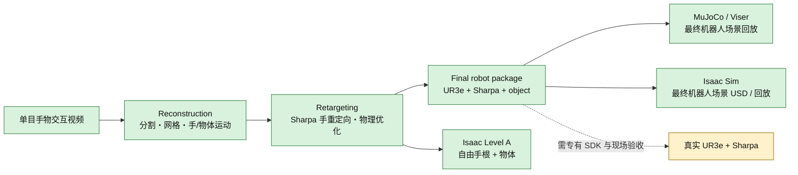

# 项目结构与运行流程



当前软件链路已经覆盖：视频重建、Sharpa 重定向、双 UR3e 逆解、带物体的
MuJoCo 最终回放包、Isaac Level A 导出，以及最终机器人场景的 Isaac USD
转换/运动学回放。真实机器人发送模块保留，但仍需要现场网络、专有 Sharpa
SDK、安全检查和实机验收。

## 1. 目录职责

| 目录 | 职责 | 主要入口 |
| --- | --- | --- |
| `reconstruction/` | 从视频得到 mask、物体网格、手部运动和物体 6-DoF 轨迹 | `reconstruction/run_pipeline.sh` |
| `retargeting/` | 构建 Sharpa MJCF，求 IK，并以 MuJoCo Warp 优化手物运动 | `retargeting/run_pipeline.sh` |
| `deployment/mujoco_replay/` | 将自由手根轨迹逆解到 UR3e，统一变换物体并生成最终机器人包 | `deployment/run_pipeline.sh mujoco-replay` |
| `isaac_export/` | 读取 Level A 或最终机器人包，生成 USD、回放并做状态回读 | `isaac_export/run_pipeline.sh` |
| `deployment/robot_replay/` | 可选真实 UR3e + Sharpa 指令发送 | `deployment/run_pipeline.sh robot-replay` |
| `dependency_management/` | 使用 `/data/jiaqimeng/retargeting_dev` 中的离线环境、模型和外部依赖 | `setup_all.sh --managed-offline` |

Git 仓库保存代码、配置、少量静态示例和锁文件。模型权重、Conda/venv、MANO、
缓存以及新任务运行结果放在外部托管目录或数据盘，不应提交到 Git。

## 2. 核心数据流

### Reconstruction 输出

- 视频逐帧 mask 与 overlay；
- SAM3D 物体 OBJ；
- HaWoR/MANO 手部结果；
- TAPIR 速度与 Fast-SAM3D 物体位姿；
- Retargeting 所需的统一输入目录。

### Retargeting 输出

典型运行目录：

```text
retargeting/outputs/sharpa/right/<task>/<run-id>/
├── config.yaml
├── scene.xml
└── trajectory_mjwp.npz
```

`trajectory_mjwp.npz` 每帧是 35 个 qpos：6 个手根自由度、22 个 Sharpa
关节和 7 个物体自由关节（位置 + `wxyz` 四元数）。

### Final robot package 输出

在 MuJoCo GUI 中点击 **Save retarget**，或使用 `--save-on-solve`，会在同一
运行目录写出：

```text
trajectory_dual_ur3e.npz       # 6 arm + 22 finger + object + time/mask
deployment_manifest.json       # 关节名、单位、资产、坐标与场景协议
scene_dual_ur3e_object.xml      # 双 UR3e + 双 Sharpa + 当前任务物体
```

物体位置和方向与手腕应用完全相同的 workspace 刚体变换，因此二者相对关系
保持不变。MuJoCo 和 Isaac 都逐帧写入参考物体位姿；这是确定性的运动学回放，
不是让物体依靠接触力自由运动的物理验证。物体被设为可视化无碰撞几何，不会
改变已有 UR3e IK 结果。

## 3. 从零运行

所有命令默认从仓库根目录开始。

### 3.1 一次恢复离线依赖

```bash
./setup_all.sh --managed-offline
source dependency_management/activate.sh
```

### 3.2 视频重建

```bash
cd reconstruction
CUDA_VISIBLE_DEVICES=0 ./run_pipeline.sh \
  /path/to/input.mp4 125 object_name right "584,529" "1"
cd ..
```

参考帧、点击坐标和物体名要替换成新视频的实际值。

### 3.3 Sharpa 重定向

```bash
cd retargeting
./run_pipeline.sh --task <task> --raw-dir /path/to/reconstruction-output
cd ..
```

看到 `Saved info to .../trajectory_mjwp.npz` 与最终 tracking error 后，计算已
保存。如果 Viser 保持服务，可以按 `Ctrl+C` 退出。

### 3.4 生成并查看最终机器人场景

交互调节并保存：

```bash
./deployment/run_pipeline.sh mujoco-replay \
  --side right \
  --traj retargeting/outputs/sharpa/right/<task>/<run-id>/trajectory_mjwp.npz \
  --speed 0.25
```

打开打印出的 Viser 地址，检查机械臂、手和物体，必要时调 workspace 后点
**Recompute IK**，最后点 **Save retarget**。

如果已有满意的 workspace 参数，可无 GUI 重新生成最终包：

```bash
./deployment/run_pipeline.sh mujoco-replay \
  --side right \
  --traj retargeting/outputs/sharpa/right/<task>/<run-id>/trajectory_mjwp.npz \
  --reference retargeting/outputs/sharpa/right/<task>/<run-id>/trajectory_dual_ur3e.npz \
  --solve-only --save-on-solve
```

### 3.5 校验最终包

```bash
./deployment/run_pipeline.sh validate-package \
  retargeting/outputs/sharpa/right/<task>/<run-id>
```

输出 `"status": "pass"` 表示数组形状、有限值、四元数、有效帧与场景文件
协议均通过静态检查。

### 3.6 生成并回放最终 Isaac 场景

```bash
RUN_DIR=retargeting/outputs/sharpa/right/<task>/<run-id>

./isaac_export/run_pipeline.sh build-usd \
  --package-dir "$RUN_DIR" \
  --headless

./isaac_export/run_pipeline.sh replay \
  --package-dir "$RUN_DIR" \
  --realtime
```

`build-usd` 自动读取 `deployment_manifest.json` 与
`scene_dual_ur3e_object.xml`，生成 `scene.usd` 和
`isaac_scene_manifest.json`。`replay` 按名称驱动 6 个 UR3e 关节、22 个手指
关节和物体位姿，并写出 `isaac_replay_report.json`。无显示器时可改用
`--headless --record-dir <directory>`。

原有 `isaac_export/outputs/<task>` Level A 包仍受支持，适合只检查自由 Sharpa
手根和物体，不含 UR3e 机械臂。

## 4. 完成标准与边界

软件验收建议同时满足：

1. Reconstruction 和 Retargeting 生成完整、有限的轨迹；
2. 最终包静态校验为 `pass`；
3. MuJoCo/Viser 中 UR3e、Sharpa 和物体位置合理且无明显穿模；
4. Isaac 构建成功，关键帧关节和物体回读误差报告为 `pass`。

这些步骤证明“视频到机器人场景运动学资产”链路可复现。若目标是实机部署，
还需要硬件标定、速度/加速度限制、碰撞区域、急停、通信恢复、低速 dry-run
和现场人员验收；若目标是验证抓持稳定性，还需单独实现受接触动力学驱动的
物体回放，而不是当前的参考位姿写入模式。
