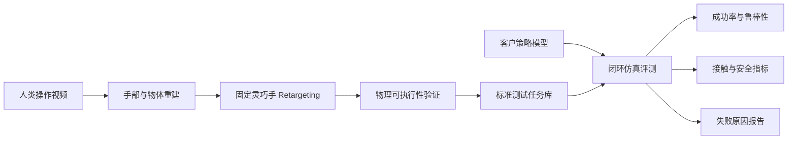

# 基于人类视频的固定灵巧手模型评测平台

日期：2026-08-13

文档定位：供项目方向讨论使用的初步方案

## TL;DR

- **项目是什么**：将客户提供的人类操作视频转换为固定 **UR3e + Sharpa 灵巧手**上的标准测试任务，再对客户的 VLA、WAM 或操作策略进行闭环仿真评测。
- **解决什么问题**：在模型上真机之前，低成本比较模型和 checkpoint，并定位抓取、接触、对齐、释放和恢复等阶段的失败。
- **与竞品的差异**：不再建设一个通用 benchmark，而是利用普通人类视频生成面向客户真实操作需求的多指接触和工具使用“定制考题”。
- **首期怎么做**：12 周内建立 3-5 个任务，使用随机、普通和参考三档策略，每个任务至少运行 30 次，输出成功率、鲁棒性、安全性和失败分类报告。
- **如何判断是否继续**：测试必须稳定区分三档策略，参考策略成功率不低于 90%，至少有一个目标客户愿意提供模型和任务视频，并在后续少量真机实验中观察到仿真排序与真机排序的正相关趋势。

## 1. 项目概览

| 问题 | 本项目的回答 |
| --- | --- |
| 面向谁 | 首先面向正在开发 VLA、WAM 或灵巧操作策略的模型团队，其次面向灵巧手厂商和机器人数据团队 |
| 客户提供什么 | 一个待测模型或多个 checkpoint，以及一个希望机器人完成的真实操作视频 |
| 我们解决什么 | 将客户的真实操作需求转换成可重复测试的固定灵巧手任务，减少早期真机试错，并定位模型在抓取、接触、对齐和恢复中的失败 |
| 我们交付什么 | 一组定制测试任务，以及模型成功率、鲁棒性、安全性和失败原因报告 |
| 为什么不是通用 benchmark | 通用 benchmark 已有较强竞品；本项目重点是从客户视频快速生成接触型、任务相关的定制考题 |
| 第一阶段价值 | 帮助客户筛选模型和 checkpoint，而不是替客户训练模型或承诺真机部署效果 |

第一阶段固定使用 **UR3e 机械臂 + Sharpa 灵巧手**，不追求一开始支持任意机器人。

## 2. 为什么做这个方向

机器人模型越来越多，但模型测评仍然存在几个问题：

1. 真机测试成本高、速度慢，难以频繁比较模型和 checkpoint；
2. 现有仿真 benchmark 多为人工预先设计的固定任务，增加新任务需要较多工程工作；
3. 普通抓放任务较多，手指接触、工具使用和失败恢复等灵巧操作测试不足；
4. 只看离线动作误差，不能证明模型能在闭环执行中真正完成任务；
5. 不同团队的测试条件不一致，模型结果难以公平比较。

本项目已有“视频重建 -> 灵巧手重定向 -> 物理仿真”的基础，因此可以进一步把视频转换为**可执行、可重复的模型测试任务**。

从公开项目可以确认，这些问题并非假设：

- SIMPLER 明确将真机评测成本高、效率低和难以复现列为核心问题，并用仿真进行模型比较和 checkpoint 选择；
- Isaac Lab-Arena 认为机器人、物体和场景组合会造成大量重复配置，目标是降低新评测任务的构建成本；
- Simple World Lab 将部署失败诊断、恢复和 Real-Robot RL 数据回流列为研究重点，说明模型团队不仅需要成功率，也需要知道模型为何失败。

但这些公开证据只能证明“模型评测和失败诊断有需求”，不能证明客户一定愿意为本项目付费。付费意愿需要通过真实客户试点验证。

## 3. 项目目标

第一阶段希望回答一个明确问题：

> 利用单段人类操作视频生成的测试任务，能否在固定灵巧手上稳定地区分不同能力水平的机器人策略，并给出可解释的失败原因？

第一阶段不做：

- 任意机械臂和任意灵巧手适配；
- 从任意互联网视频自动生成任务；
- 为客户训练完整策略；
- 仅凭仿真结果承诺真机成功率；
- 使用“与参考轨迹越接近，模型越好”作为主要评分方式。

## 4. 总体架构

其中，retargeting 后的参考轨迹用于证明任务在固定本体上**可以完成**，但不作为唯一正确答案。客户模型只要用其他合理方式完成任务，也应判定成功。

## 5. 产品形态

### 5.1 输入

平台侧输入：

- 符合采集规范的人类操作视频；
- 操作物体名称和一个真实尺寸；
- 任务目标，例如“将物体放入盒中”或“使用搅拌器完成搅拌”。

客户侧输入：

- 能够根据图像和机器人状态输出动作的策略模型；
- 模型运行环境和必要权重；
- 模型使用的观测、动作和推理频率说明。

## 6. 输出与评测指标

平台输出模型或 checkpoint 对比报告。第一版不急于合成一个总分，而是报告以下五类结果：

| 维度 | 主要指标 |
| --- | --- |
| 任务能力 | 成功率、部分完成率、最终物体状态 |
| 灵巧操作 | 稳定抓取、滑移、掉落、重抓 |
| 鲁棒性 | 初始状态、摩擦、质量、视觉和外力变化下的成功率 |
| 安全性 | 碰撞、穿透、关节越界、异常动作 |
| 效率 | 完成时间、路径长度、重试次数、推理延迟 |

每个模型和任务至少运行 30 次，使用相同随机条件进行比较。正式结论应报告置信区间，避免根据少量测试的偶然差异判断模型优劣。

## 7. 测试任务如何进入正式任务库

每个视频生成的任务必须依次通过四项检查：

1. **重建通过**：手、物体、尺度和重力方向基本可信；
2. **运动学通过**：固定机器人能够跟随参考行为，没有明显关节越界或碰撞；
3. **物理通过**：参考控制器在仿真中能够真正完成任务，而不只是播放轨迹；
4. **区分度通过**：随机策略、普通基线和参考策略能够形成稳定的结果差异。

正式准入阈值由第 12 节的 Go/No-Go 标准统一判断，不在任务生产阶段重复定义。

## 8. 竞品与相邻项目

以下调研基于截至 2026-08-13 的论文、官网和公开代码。

| 项目 | 已有能力 | 与本项目的关系 |
| --- | --- | --- |
| [SIMPLER](https://simpler-env.github.io/) | 在 Google Robot、WidowX 等固定真机配置上进行仿真策略评测，并验证仿真与真机模型排序的相关性 | 最直接的评测竞品；任务和场景主要预先构建，不以普通人类操作视频生成灵巧手测试为核心 |
| [RoboTwin 2.0](https://robotwin-platform.github.io/) | 50 个双臂任务、5 种机器人本体、强领域随机化、统一模型评测和十万级轨迹 | 直接替代方案；任务来自物体库、生成模型和仿真程序，不以真实人类视频作为任务来源 |
| [RoboCasa365](https://robocasa.ai/) | 365 个厨房任务、2,500 多个场景，支持多种策略训练与 leaderboard | 大型标准任务库；场景覆盖广，但重点不是固定灵巧手和视频生成接触任务 |
| [BEHAVIOR-1K](https://behavior.stanford.edu/) | 1,000 个家庭活动，包含刚体、柔性体、液体和状态变化 | 长程家庭任务 benchmark；规模大，但任务制作复杂，与本项目的轻量视频扩展路线不同 |
| [ManiSkill](https://maniskill.readthedocs.io/en/latest/) | 高速 GPU 仿真、训练基线、灵巧操作和 real-to-sim 评测 | 可作为底层平台或替代方案；主要提供通用仿真和人工任务构建能力 |
| [VLABench](https://vlabench.github.io/) | 100 类语言条件任务、2,000 多个物体，同时评测 VLA、VLM 和长程推理能力 | 通用 VLA 评测竞品；任务经过设计并由技能程序生成，不从客户的人类操作视频构建定制接触任务 |
| [Isaac Lab-Arena](https://github.com/isaac-sim/IsaacLab-Arena) | 将场景、本体和任务模块化组合，支持 GR00T、OpenPI 等策略的大规模评测 | 强底层平台和潜在替代方案；降低组合任务开发成本，但仍需要用户提供场景资产和任务定义，目前也处于 alpha 阶段 |
| [DexMV](https://yzqin.github.io/dexmv/) | 从人类视频恢复手和物体运动，重定向到多指机器人手并用于模仿学习 | 视频与灵巧手方向最接近；重点是生成示范和训练策略，不是接入客户模型形成标准评测服务 |
| [HiFi-UMI](https://cloud.simpleai.tech/simple-world-lab/hifi-umi/) | 使用专用采集硬件生成高精度双臂末端轨迹，进行回放验证、VLA/WAM 训练与真机测试 | 数据生产方向的相邻方案；使用双指夹爪级动作表示，不提供完整人手指尖和多指接触表示 |

### 8.1 竞争结论与差异

市场并不缺少通用仿真器、标准任务库或模型运行框架。若本项目只是提供“接入模型并跑成功率”，会直接面对 NVIDIA、RoboTwin、VLABench 和 ManiSkill，缺乏明显优势。

本项目应将产品边界收敛为：

> 面向固定灵巧手的“视频到定制考题”服务，重点覆盖多指接触、工具使用和恢复行为，并提供阶段化失败诊断。

相较现有方案，我们的任务来自客户真实操作视频，可以围绕具体物体和操作方式扩充测试，并将 reconstruction、retargeting 和模型失败放在同一条链路中诊断。主要风险是任务规模小、只支持固定本体、视频误差可能污染评测，而且仿真与真机的相关性尚未验证。

未来可将 Isaac Lab-Arena 或 ManiSkill 用作底层评测基础设施，而不是重复建设通用仿真平台。

## 9. 谁可能是客户

### 9.1 客户优先级

| 优先级 | 客户类型 | 为什么可能使用 | 主要障碍 |
| --- | --- | --- | --- |
| 1 | 已有 VLA/WAM、并需要比较模型或 checkpoint 的团队 | 真机评测成本高，需要定制任务和失败诊断 | 模型必须能够适配固定 UR3e + Sharpa 接口 |
| 2 | 使用 Sharpa 或愿意采用固定本体做横向比较的灵巧操作团队 | 无需先做新本体适配，试点成本最低 | 当前公开可确认的客户数量有限 |
| 3 | 灵巧手和人形机器人厂商 | 需要证明硬件与控制模型的任务能力 | 多数厂商更希望测试自有本体 |
| 4 | UMI 和机器人数据团队 | 需要验证数据是否真正改善策略效果 | 它们可能已有内部回放和评测工具 |
| 5 | 高校和研究机构 | 需要可复现 benchmark 和论文问题 | 商业付费能力相对较弱 |

深朴智能公开的 Simple World Lab 已将 VLA/WAM、跨本体、部署失败回流和 Real-Robot RL 列为研究重点，因此存在明确的模型评测和失败诊断需求信号。但深朴自身已有 HiFi-UMI 和仿真回放能力，更适合作为联合验证伙伴，不能假设其一定会购买普通轨迹服务。

### 9.2 不适合的客户

- 只做导航或移动、不涉及手部操作的团队；
- 只使用简单平行夹爪且近期没有灵巧操作需求的团队；
- 要求立即支持任意机器人本体的客户；
- 只需要大量训练数据、不关心模型评测的客户；
- 要求仿真分数直接等同真机成功率的客户。

## 10. 首个验证方案

第一轮不接复杂客户项目，先完成两个内部任务：

1. **刚体抓取搬运**：成功条件清晰，用于验证评测平台是否可靠；
2. **whisking 工具交互**：体现长时间接触和灵巧操作特点。

每个任务测试三档策略：

- 随机策略；
- 一个普通规则或学习基线；
- retargeting 参考控制器。

每档至少运行 30 次，检查是否能形成稳定排序，并验证平台能否区分抓取、滑移、掉落、碰撞和超时等失败。

## 11. 项目排期

以下排期假设现有 reconstruction 和 retargeting 流水线可继续使用，团队至少有 1 名主要开发人员，并能获得必要 GPU 资源。

| 时间 | 工作内容 | 阶段交付 |
| --- | --- | --- |
| 第 1-2 周 | 确定固定本体、观测方式、动作方式和第一个抓放任务 | 一份冻结的评测协议；参考策略可完成任务 |
| 第 3-5 周 | 打通模型闭环运行，加入随机策略和普通基线 | 单任务、多次重复测试结果 |
| 第 6-8 周 | 增加 whisking 等 3-5 个任务，加入扰动和失败分类 | 小型灵巧操作测试集与多维报告 |
| 第 9-10 周 | 接入一个外部模型或不同 checkpoint | 首份客户模型对比报告 |
| 第 11-12 周 | 汇总稳定性、区分度和工程成本 | Go/No-Go 评审与下一阶段方案 |

12 周总体交付包括：固定本体评测协议、3-5 个标准任务、三档基线、模型重复测试能力，以及一份外部模型或多 checkpoint 对比报告。

如果 12 周内部验证通过，后续用 3-6 个月进行：

- 增加任务和物体数量；
- 与一个真实客户联合试点；
- 在 UR3e + Sharpa 真机上进行少量配对实验；
- 验证仿真中的模型排序是否与真机排序一致；
- 决定是否扩展第二种机器人本体。

## 12. Go/No-Go 判断

满足以下条件，建议继续：

- 三档策略能形成稳定、可重复的能力排序；
- 参考策略在标准条件下成功率不低于 90%；
- 新模型接入时间控制在 1-2 个工作日；
- 至少能自动区分几类主要失败原因；
- 客户认为报告能够帮助其选择模型、改进数据或减少真机测试；
- 至少一个目标客户愿意提供模型和任务视频，并参与一次联合评测；
- 少量真机实验中，仿真排序与真机排序具有正相关趋势。

出现以下情况，应调整或停止：

- 结果主要由视频重建误差决定；
- 参考策略本身也无法稳定完成任务；
- 不同模型在测试中无法拉开差距；
- 每个新任务都需要大量人工工程；
- 客户只关心其自有本体，不接受固定本体测试；
- 仿真排序与真机排序长期不一致。

## 13. 可沉淀的研究方向

该项目可以形成三个连续研究问题：

1. **视频到测试任务**：如何从单段人类视频构建物理可执行的机器人测试任务？
2. **接触感知评测**：如何评测模型是否正确完成抓取、工具使用和恢复，而不只是跟随参考轨迹？
3. **仿真到真机校准**：哪些仿真指标能够稳定预测固定本体上的真机模型排序？

## 14. 需要老师确认的事项

1. 是否认可先固定 UR3e + Sharpa，而不立即支持任意本体？
2. 第一阶段更偏向论文研究，还是面向深朴智能等潜在客户做联合试点？
3. 是否可以获得至少一个外部模型或多个 checkpoint 用于测试区分度？
4. 是否具备后续少量真机配对评测条件？
5. 12 周后最重要的判断标准是研究创新、客户反馈，还是可演示系统？

## 15. 参考资料

- [SIMPLER: Evaluating Real-World Robot Manipulation Policies in Simulation](https://simpler-env.github.io/)
- [RoboTwin 2.0](https://robotwin-platform.github.io/)
- [RoboCasa365](https://robocasa.ai/)
- [BEHAVIOR-1K](https://behavior.stanford.edu/)
- [ManiSkill](https://maniskill.readthedocs.io/en/latest/)
- [VLABench](https://vlabench.github.io/)
- [Isaac Lab-Arena](https://github.com/isaac-sim/IsaacLab-Arena)
- [DexMV](https://yzqin.github.io/dexmv/)
- [HiFi-UMI](https://cloud.simpleai.tech/simple-world-lab/hifi-umi/)
- [Simple World Lab](https://cloud.simpleai.tech/simple-world-lab/)